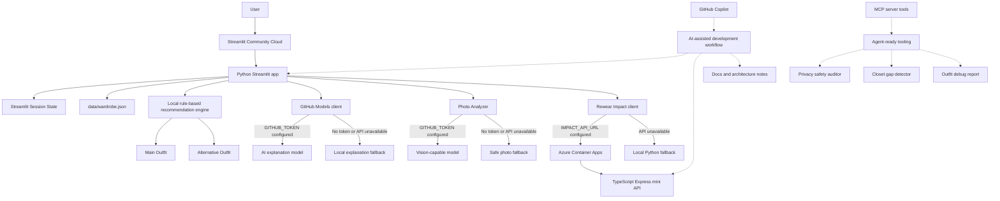

# 🧙 Wardrobe Wizard

[](https://github.com/microsoft/agentsleague)
[](https://github.com/microsoft/agentsleague/tree/main/starter-kits/1-creative-apps)
[](https://github.com/features/copilot)
[](https://modelcontextprotocol.io)
[](https://wardrobe-wizard.streamlit.app/)
[](LICENSE)

> **You already own the perfect outfit. You just can't see it right now.**
> Wardrobe Wizard helps you pick one good-enough look from clothes you already own — with a real alternative, an explanation of why it works, and a no-buy sustainability estimate. No shopping links. No judgment. Just your wardrobe, finally useful.

---

## 🎬 Demo

📹 *[Watch the demo video →](https://youtu.be/TODO)*

**Try it now — no login, no account, no setup:**
👉 **[wardrobe-wizard.streamlit.app](https://wardrobe-wizard.streamlit.app/)**

---

## 💡 Why this exists

Most mornings, the problem is not a lack of clothes. It is too many choices, too little energy, and a familiar feeling of *"I have nothing to wear"* while staring at a full wardrobe.

> People often buy more clothes not because they have nothing — but because **deciding what to wear takes energy**.

Wardrobe Wizard is a calm decision-support tool. It does not connect to shopping sites. It does not push products. It works entirely from the user's existing wardrobe and helps them:

- reduce decision fatigue,
- reuse clothes they already own,
- understand the real impact of buying new vs. rewearing,
- stay in control of what the AI sees and suggests.

The guiding principle: **AI should sometimes make things calmer, not louder.**

---

## ✨ Features

### 👗 Outfit Recommendation

Pick a real-life scenario, choose a style vibe or two, and get a complete outfit with a genuine alternative — not just a random list of items.

| What you set | What you get |
|---|---|
| Scenario (Office, Date night, Travel, Custom) | **Main Outfit** — scored, complete, context-aware |
| Up to 2 style vibes (cozy, polished, minimal…) | **Alternative Outfit** — a real second option |
| Comfort preference | **Why it works** — local explanation or AI-generated |
| Favorite item flags | **Rewear Impact** — no-buy sustainability estimate |

The recommendation engine is **local, rule-based, and inspectable**. No API call required to get outfit results. Outfits are never black-box.

### ✈️ Travel Day Context

Travel Day unlocks practical packing context:

| Field | Options |
|---|---|
| Departure climate | hot · warm · mild · cold · rainy |
| Destination climate | hot · warm · mild · cold · rainy |
| Season | spring · summer · autumn · winter |
| Flight type | short flight · long-haul flight |

No live weather API. The user controls the context; local rules interpret it. This keeps the app reliable and transparent.

### 🧘 Low-Energy Decision Support

For days when even picking a scenario feels like too much. One practical outfit. Fewer choices. No overwhelm.

This is intentional product design: not every AI experience should maximize options.

### 📝 Add Items in Natural Language

Describe one item or a whole batch. The parser structures it for you.

```text
blue linen shirt, top, casual, summer, breathable
```

```text
black ankle boots, shoes, elegant, date night
cream cardigan, jacket, cozy, office
silver earrings, accessory, minimal, evening
```

Before anything is saved, an **editable review table** appears. You approve what gets added — AI parsing helps, but the human decides.

The flow includes controlled categories, tag normalization, category mismatch warnings, and duplicate prevention.

### 📸 Clothing-Only Photo Analysis

Upload an outfit photo and the app detects visible clothing items using GitHub Models vision capabilities.

**What the photo analyzer will never do:**

| ❌ Not allowed | Why |
|---|---|
| Identify the person | Privacy |
| Comment on body shape or attractiveness | Dignity |
| Infer age, gender, or ethnicity | Ethics |
| Infer health, disability, or pregnancy | Safety |
| Store the image permanently | Data minimalism |

Detected items appear in a **human review table** before being added to the session wardrobe. If no vision model is available, the feature fails safely and the rest of the app keeps working.

### 🌱 Rewear Impact

After each outfit recommendation, Wardrobe Wizard shows an educational no-buy comparison estimate: the rough new-production water and CO₂e impact that may be avoided by rewearing existing items instead of buying similar new ones.

The calculation uses a real **TypeScript + Express mini API** deployed to **Azure Container Apps**. If the API is unavailable (scale-to-zero wake-up), a local Python fallback keeps the feature working.

Careful wording is used throughout:
- *"estimated new-production impact avoided"*
- *"no-buy comparison estimate"*
- *"illustrative category estimate"*
- *"public-source benchmark"*

This is not a certified carbon calculator. It is an honest, educational nudge toward using what you have.

### 🗂️ Browse and Edit Wardrobe

The app ships with a 36-item synthetic sample wardrobe. Users can:

- filter by category and style tag,
- search by item name,
- mark items as favorites (favorites get a scoring boost),
- edit rows in the current session,
- add session-only items,
- restore the full sample wardrobe.

All changes are **session-only**. Nothing is written to disk. Nothing persists between page loads.

---

## 🏗️ Architecture

Three practical layers — each with a clear job and a fallback:



### What runs where

| Layer | How it works |
|---|---|
| Outfit selection | Local rule-based Python — no API call required |
| Explanation text | GitHub Models when configured, local fallback otherwise |
| Photo analysis | Vision model when configured, safe failure otherwise |
| Rewear Impact | TypeScript API on Azure when available, Python fallback otherwise |
| Wardrobe storage | JSON sample data + Streamlit session state |
| MCP tools | Standalone agent-ready tooling |

This separation makes the app easier to reason about, safer to demo, and reliable when external services are unavailable.

---

## 🔧 How the recommendation engine works

The engine is local and rule-based. It scores every wardrobe item against:

- **scenario** — office, date night, travel, custom,
- **category** — top, bottom, jacket, shoes, accessory, dress,
- **weather or travel context** — climate match, season, flight type,
- **style vibes** — cozy, polished, minimal, elegant, streetwear…,
- **formality** — matched to scenario requirements,
- **comfort** — matched to user preference,
- **favorite flag** — small scoring boost for marked favorites.

It then assembles a complete, compatible outfit and generates a genuine alternative — not a copy of the first result.

The logic lives in `src/recommendation_engine.py`.

---

## 🛡️ Responsible AI and Privacy

Wardrobe Wizard is built around a few practical safety rules:

- ✅ The user stays in control at every step
- ✅ AI-detected items require human review before being added
- ✅ Photo analysis is clothing-only — no sensitive inferences
- ✅ No login, no persistent database, no profile building
- ✅ Session-only changes disappear when the session resets
- ✅ External API failures fall back gracefully — no silent errors
- ✅ MCP privacy auditor tool can inspect outfit AI text for risky language

Full documentation: `docs/ai_safety_and_privacy.md`

---

## 🔌 MCP Tools

Wardrobe Wizard includes standalone MCP tooling for agent-ready and future Copilot-style workflows:

| Tool | Purpose |
|---|---|
| `closet_gap_detector` | Finds missing wardrobe categories or practical weak spots |
| `privacy_safety_auditor` | Checks outfit AI text for unsafe personal inferences |
| `outfit_debug_report` | Explains why an outfit recommendation did or did not work |

The MCP server is not required for the Streamlit app to run. It is an extension path for agent workflows.

Details: `docs/mcp_tools.md`

---

## 🤖 GitHub Copilot Usage

GitHub Copilot was a genuine development partner throughout the project — not just autocomplete.

### 🧠 Architecture and planning

- Shaped the separation between local rule-based recommendations and generative AI explanations
- Helped design the fallback-first architecture (every external service has a local fallback)
- Structured the TypeScript Rewear Impact mini API
- Clarified the boundary between active runtime services and documented future extensions

### ⚡ Python and Streamlit development

- Streamlit UI refinement and session-state handling
- Wardrobe item review flows and duplicate-prevention logic
- Category validation and tag normalization
- Photo upload handling and safe error messages

### 🔨 TypeScript mini API

- Express endpoint structure and request/response shape
- TypeScript build checks and Docker deployment notes
- Readable API documentation

### 🛡️ Responsible AI review

- Wording around sensitive attributes in photo analysis
- Fallback behavior when external models are unavailable
- Public documentation for AI limitations and sustainability disclaimers

### 📝 Documentation and submission polish

- README structure and architecture explanation
- Public-release cleanup and smoke-test planning
- Hackathon submission storytelling

> Screenshots of Copilot interactions are in `docs/copilot-usage/`

---

## 🏆 Evaluation Criteria Alignment

| Criteria | Weight | How Wardrobe Wizard delivers |
|---|---|---|
| **Accuracy & Relevance** | 20% | Working public demo, public repo, GitHub Copilot throughout, real user-centered AI problem with practical output |
| **Reasoning & Multi-step Thinking** | 20% | Outfit scoring combines scenario + climate + vibes + formality + comfort + favorites + category completeness — all local and inspectable |
| **Creativity & Originality** | 15% | Wardrobe reuse framing, decision-fatigue angle, clothing-only photo review, Rewear Impact sustainability layer, corgi wizard identity — not a standard CRUD app |
| **User Experience & Presentation** | 15% | Low-energy mode, human review before AI adds anything, friendly fallbacks, no red errors, no login friction |
| **Reliability & Safety** | 20% | Every external service has a local fallback. Photo analysis has enforced ethical boundaries. No persistent data. Session-only changes. |
| **Community Vote** | 10% | Relatable premise — everyone has had the "nothing to wear" moment. Sustainability angle. Corgi mascot. |

---

## 🚀 Quick Start

### 1. Clone

```bash
git clone https://github.com/ffbogusia/wardrobe-wizard-submission.git
cd wardrobe-wizard-submission
```

### 2. Create a virtual environment

```bash
python -m venv .venv
# Windows
.venv\Scripts\activate
# macOS/Linux
source .venv/bin/activate
```

### 3. Install and run

```bash
pip install -r requirements.txt
streamlit run app.py
```

---

## ⚙️ Environment Variables

The app runs fully without external services. Optional integrations:

```bash
# AI explanations and clothing-only photo analysis
GITHUB_TOKEN=your_github_token_here

# Rewear Impact mini API (falls back to local Python if unavailable)
IMPACT_API_URL=https://your-container-app-url.azurecontainerapps.io
```

Use `.env.example` as a template. Do not commit real secrets. On Streamlit Community Cloud, add secrets in the app settings panel.

---

## 🌐 Rewear Impact Mini API

A real TypeScript + Express API deployed to Azure Container Apps.

```bash
cd impact-api
npm install
npm run build
npm start
```

```bash
# Health check
curl http://localhost:3000/health

# Example call
curl -X POST http://localhost:3000/api/rewear-impact \
  -H "Content-Type: application/json" \
  -d '{"items":[{"name":"White cotton T-shirt","category":"top"},{"name":"Blue jeans","category":"bottom"}],"favorite_item_ids":[]}'
```

**Docker:**
```bash
cd impact-api
docker build -t wardrobe-wizard-impact-api .
docker run -p 3000:3000 wardrobe-wizard-impact-api
```

If the Azure Container App is scaled to zero, the first request uses the local Python fallback while the container wakes up. This is expected behavior — the demo stays usable.

---

## 🗂️ Project Structure

```text
wardrobe-wizard/
├── app.py
├── README.md
├── requirements.txt
├── requirements-mcp.txt
├── .env.example
├── .streamlit/
│   └── config.toml
├── assets/
│   ├── corgi-wizard.png
│   └── corgi-mascot-sticker.png
├── data/
│   └── wardrobe.json
├── src/
│   ├── ai_client.py
│   ├── impact_client.py
│   ├── item_parser.py
│   ├── photo_analyzer.py
│   ├── recommendation_engine.py
│   └── corgi_mascot.py
├── impact-api/
│   ├── Dockerfile
│   ├── package.json
│   ├── tsconfig.json
│   └── src/
│       ├── server.ts
│       └── impactEstimator.ts
├── mcp_server/
│   └── wardrobe_mcp_server.py
├── docs/
│   ├── architecture.md
│   ├── architecture_diagram.md
│   ├── azure_architecture.md
│   ├── deployment.md
│   ├── sustainability_methodology.md
│   ├── ai_safety_and_privacy.md
│   ├── mcp_tools.md
│   ├── project_scope.md
│   └── recommendation_rules.md
└── knowledge/
    ├── outfit_matching_guide.md
    ├── wardrobe_dataset_summary.md
    └── wardrobe_style_rules.md
```

---

## 🛠️ Tech Stack

| Technology | Purpose |
|---|---|
| Python | Main application logic |
| Streamlit | Interactive web UI |
| pandas | Data display and editing |
| JSON | Sample wardrobe data |
| GitHub Models | AI explanations and clothing-only photo analysis |
| TypeScript | Rewear Impact mini API |
| Node.js + Express | API runtime |
| Docker | Containerization for the mini API |
| Azure Container Apps | Hosted Rewear Impact API |
| Streamlit Community Cloud | Public app deployment |
| MCP | Agent-ready tool interface |
| GitHub Copilot | AI-assisted development throughout |

---

## ✅ Smoke Test Checklist

```bash
python -m compileall app.py src mcp_server
cd impact-api && npm run build && npm audit && cd ..
```

Manual checks:
- [ ] Landing page loads
- [ ] Recommend Outfit works
- [ ] Travel day hot-to-cold scenario works
- [ ] Main Outfit and Alternative Outfit appear
- [ ] Why it works appears
- [ ] Rewear Impact appears (mini API or fallback)
- [ ] Add one item works, review table appears
- [ ] Add multiple items works
- [ ] Photo Analyzer respects clothing-only constraints
- [ ] Browse Wardrobe search and filter works
- [ ] No red Streamlit errors

---

## 📝 License

MIT License.

---

## 🙏 Acknowledgments

- **GitHub Copilot** — AI-assisted development throughout
- **Streamlit** — public app interface and deployment
- **GitHub Models** — AI explanations and clothing-only photo analysis
- **Azure Container Apps** — Rewear Impact mini API hosting
- **Model Context Protocol** — agent-ready tooling ecosystem

---

**🧙 Wardrobe Wizard: less "I have nothing to wear," more "wait, this actually works."**
