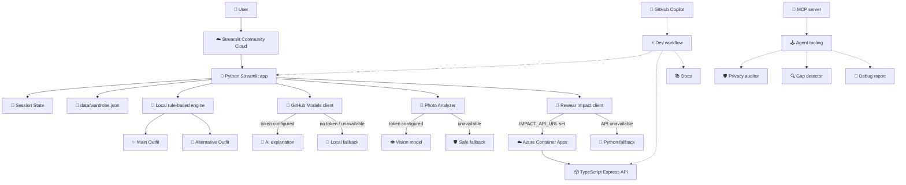

<div align="center">

# ✨👗 Wardrobe Wizard 🪄✨

### *Your closet is full. Your brain is tired. Let's fix that.*

<br>

```
 ╔══════════════════════════════════════════════════════╗
 ║  "I have nothing to wear" — said every person ever  ║
 ║       with 47 items hanging in their closet         ║
 ╚══════════════════════════════════════════════════════╝
```

<br>

[](https://github.com/microsoft/Agents-League-AISF-Regulations)
[](https://developer.microsoft.com/en-us/reactor/events/27031/)
[](https://github.com/features/copilot)

[](https://wardrobe-wizard.streamlit.app/)
[](https://modelcontextprotocol.io)
[](LICENSE)

<br>

**[✨ Try the live demo](https://wardrobe-wizard.streamlit.app/) · [📹 Watch the demo video](https://youtu.be/TODO) · [📖 Docs](docs/)**

</div>

---

## 💜 What is this, actually?

You know that feeling. You're late. You're tired. You open the wardrobe and your brain just... stops working. Everything looks wrong. Nothing matches. You end up buying something new you didn't need, wearing the same three outfits on rotation, or going back to bed.

**Wardrobe Wizard is built for that exact moment.**

It's a calm AI companion that looks at your actual clothes, understands your vibe and the occasion, and puts together one real outfit — plus a genuine alternative. No shopping links. No judgment. No "you should really try a capsule wardrobe" lectures.

> 💡 **The idea behind it:** people buy more clothes not because they have nothing to wear, but because *choosing takes energy*. AI should help with that — not make it louder.

The outfit engine is **local, rule-based, and inspectable** — it never phones home just to tell you to wear jeans. The AI layers add explanation text and photo analysis on top, with graceful fallbacks when they're not available.


---

## 🌈 What the Wizard can do

### 👗 Outfit of the Day (and a backup)

Tell the Wizard the situation. Pick your vibe. Get dressed.

| You tell it... | It gives you... |
|:---|:---|
| 🎯 Scenario — *office rain, date night, travel, custom* | 👗 **Main Outfit** — complete, scored, context-aware |
| 💅 Up to 2 style vibes — *cozy, polished, minimal, elegant...* | 👘 **Alternative Outfit** — a real second option, not a copy |
| 🛋️ Comfort preference | 💬 **Why it works** — rule-based or AI-generated explanation |
| ⭐ Favorite item flags | 🌱 **Rewear Impact** — sustainability estimate for the look |

The recommendation engine scores each wardrobe item against scenario, climate, vibe, formality, comfort, and category completeness — all **locally**, all **transparently**, zero black box.


---

### ✈️ Packing for a trip? It's got you.

Travel Day unlocks a whole extra layer of context — because "mild to tropical" is a very different packing problem than "cold to cold":

```
  departure climate  →  hot · warm · mild · cold · rainy
  destination climate →  hot · warm · mild · cold · rainy
  season             →  spring · summer · autumn · winter  
  flight             →  short-haul · long-haul
```

No live weather API — you tell it the context, local rules handle the rest. Reliable, offline-capable, no API keys needed.

---

### 😮‍💨 Low-Energy Mode — for the really hard days

Sometimes you don't want options. You just want someone to tell you what to wear.

Low-Energy Decision Support strips it down to the minimum: one practical outfit, no overwhelming choices, a little reassurance that you're done. This is intentional product design — **AI should sometimes make things calmer, not louder.**


---

### 💬 Add things by just... describing them

```
blue linen shirt, top, casual, summer, breathable
```

```
black ankle boots, shoes, elegant, date night
cream cardigan, jacket, cozy, office
silver earrings, accessory, minimal, evening
```

Type one item or dump in a whole batch. The parser structures it into proper wardrobe rows — and then shows you an **editable review table before anything gets saved**. AI helps, but you decide what goes in.

The flow includes controlled categories, tag normalization, category mismatch warnings, and duplicate prevention. No surprises.

---

### 📸 Photo analysis — clothing only, always

Upload an outfit photo. The Wizard uses GitHub Models vision capabilities to detect the visible clothing items — and that's it.

Here's the wall it will never cross:

| 🚫 What it will never do | Why |
|:---|:---|
| Identify who the person is | Privacy |
| Comment on body shape or attractiveness | Dignity |
| Guess age, gender, or ethnicity | Ethics |
| Infer health, disability, or pregnancy | Safety |
| Store the image after the session | Data minimalism |

Everything detected shows up in a **human review table** first. You pick what gets added to your session wardrobe. If the vision model is unavailable, the feature fails safely and the rest of the app keeps working.


---

### 🌿 Rewear Impact — because your wardrobe is already doing something good

After every outfit recommendation, Wardrobe Wizard shows you an educational estimate of the new-production impact that *might* be avoided by rewearing what you already own instead of buying similar new items:

- 💧 estimated water use avoided
- 🌫️ estimated CO₂e avoided  
- ⭐ whether your favourite items made the cut
- 📋 item-level breakdown

This runs on a real **TypeScript + Express mini API deployed to Azure Container Apps**. If the API is still waking up (scale-to-zero), a local Python fallback kicks in and the feature keeps working.

The wording is careful throughout — *"estimated new-production impact avoided," "no-buy comparison estimate," "illustrative category estimate."* This is not a certified carbon calculator. It's an honest nudge toward using what you have.


---

### 🗂️ Browse, search, and edit your wardrobe

The app ships with 36 sample wardrobe items. You can:

- 🔍 search by name or filter by category and style tag
- ⭐ mark favorites (they get a small scoring boost in recommendations)
- ✏️ edit rows inline within the session
- ➕ add your own items
- 🔄 restore the full sample wardrobe at any time

All changes are **session-only** — nothing persists, nothing is stored, nothing is shared.


---

## 🏗️ How it's built

Three layers, each with its own job — and a fallback for when things go sideways:



### The rule: every external service has a local fallback

| Layer | What does the work |
|:---|:---|
| 👗 Outfit selection | Local rule-based Python — **no API needed** |
| 💬 Explanation text | GitHub Models → local fallback |
| 📸 Photo analysis | Vision model → safe failure message |
| 🌱 Rewear Impact | TypeScript API on Azure → Python fallback |
| 💾 Wardrobe storage | JSON file + Streamlit session state |
| 🔌 MCP tools | Standalone — optional extension layer |

---

## 🧠 How the recommendation engine actually works

The engine is local and inspectable. For each item in the wardrobe, it calculates a score based on:

- 🎯 **scenario** — does this item suit office rain, a date, travel, or the custom context?
- 📦 **category** — is the outfit actually complete? (top + bottom + shoes, or dress + shoes, etc.)
- 🌡️ **climate** — does the fabric and coverage match the weather or travel context?
- 💅 **style vibes** — does the item's tags match the chosen vibes?
- 👔 **formality** — appropriate for the occasion?
- 🛋️ **comfort** — matches the comfort preference?
- ⭐ **favorites** — small boost for marked favorites

Then it assembles the highest-scoring complete outfit, and a genuine second alternative — not just a reshuffled copy of the first one.

All of this lives in `src/recommendation_engine.py`.

---

## 🛡️ Responsible AI — the non-negotiables

Wardrobe Wizard is designed around user control and privacy from the ground up:

- ✅ The user reviews all AI-detected items before they're added — always
- ✅ Photo analysis is clothing-only, with hard prompt-level constraints
- ✅ No sensitive inferences — ever (body, age, gender, health, ethnicity...)
- ✅ No login, no account, no profile, no persistent database
- ✅ Session-only changes — disappear when the session resets
- ✅ Every external service fails gracefully — no silent errors
- ✅ MCP privacy auditor tool checks AI-generated outfit text for risky language

Full details: `docs/ai_safety_and_privacy.md`

---

## 🔌 MCP Tools — agent-ready from day one

Three standalone tools for agent workflows and future Copilot integration:

| Tool | What it does |
|:---|:---|
| 🔍 `closet_gap_detector` | Finds missing categories or wardrobe weak spots |
| 🛡️ `privacy_safety_auditor` | Checks outfit AI text for unsafe personal inferences |
| 🐛 `outfit_debug_report` | Explains why a recommendation did or didn't work |

The MCP server is not required for the Streamlit app to run — it's an extension path for agent workflows.

Full docs: `docs/mcp_tools.md`

---

## 🤖 GitHub Copilot — how it was actually used

Copilot was a genuine development partner here, not just autocomplete. Here's what that looked like in practice:

### 🏛️ Architecture decisions
- Designed the separation: local rule-based engine vs. generative AI explanation layer
- Shaped the fallback-first architecture — every external service has a local fallback
- Structured the TypeScript Rewear Impact mini API and its Docker/Azure deployment path
- Clarified which services are active runtime and which are documented future extensions

### 🐍 Python + Streamlit
- Streamlit UI refinement and session-state handling
- Wardrobe review flow, duplicate-prevention logic, and category mismatch detection
- Photo upload handling and safe error messaging
- Tag normalization and controlled vocabulary enforcement

### 📦 TypeScript mini API  
- Express endpoint structure, request/response shape, and error handling
- TypeScript build and Docker deployment notes
- Readable API documentation

### 🛡️ Responsible AI review
- Wording around sensitive attributes in photo analysis prompts
- Fallback behavior documentation
- Sustainability estimate disclaimer wording
- Public documentation for AI limitations

### 📝 Documentation + submission polish
- README structure and architecture narrative
- Public-release cleanup and smoke-test planning

> Screenshots of Copilot interactions live in `docs/copilot-usage/`

---

## 🏆 How Wardrobe Wizard maps to the judging criteria

> 💜 **Hack for Good** — Wardrobe Wizard tackles a genuine everyday need: decision fatigue is real, and buying new clothes because choosing feels hard is a measurable sustainability problem. This is a tool for that.
>
> ♿ **Accessibility** — Low-Energy Decision Support is accessibility-first by design: fewer choices, less cognitive load, one good answer. Built for the days when your brain just isn't cooperating.

| Criteria | Weight | What the Wizard delivers |
|:---|:---:|:---|
| 🎯 **Accuracy & Relevance** | 20% | Working public demo · Public repo · GitHub Copilot throughout · Real user problem with practical, testable output |
| 🧠 **Reasoning & Multi-step Thinking** | 20% | 7 scoring signals combined per item · Category completeness check · Climate + travel context interpretation · Alternative outfit generation |
| 🎨 **Creativity & Originality** | 15% | Decision-fatigue angle · Clothing-only photo ethics · Rewear Impact sustainability layer · Corgi wizard mascot · Low-energy mode as intentional calm design |
| 💅 **User Experience** | 15% | Human review before AI adds anything · Low-energy mode · Friendly fallbacks · No red errors · No login friction · Demo-ready at all times |
| 🛡️ **Reliability & Safety** | 20% | Every external service has a local fallback · Hard ethical constraints on photo analysis · No persistent data · Session-only changes · Graceful degradation throughout |
| 💜 **Community Vote** | 10% | Relatable premise · Sustainability feel-good moment · Corgi mascot · "Wait, this actually works" factor |

---

## 🚀 Get it running in 3 steps

```bash
# 1. Clone
git clone https://github.com/ffbogusia/wardrobe-wizard-submission.git
cd wardrobe-wizard-submission

# 2. Set up Python environment
python -m venv .venv
source .venv/bin/activate        # macOS/Linux
# .venv\Scripts\activate         # Windows

# 3. Install and launch ✨
pip install -r requirements.txt
streamlit run app.py
```

---

## 🛠️ Tech stack

| | Technology | What it does here |
|:---:|:---|:---|
| 🐍 | Python | Main app logic |
| 🎈 | Streamlit | Interactive web UI + deployment |
| 🐼 | pandas | Wardrobe data display and editing |
| 🤖 | GitHub Models | AI explanations + clothing-only photo analysis |
| 📘 | TypeScript | Rewear Impact mini API |
| ⚡ | Node.js + Express | API runtime |
| 🐳 | Docker | API containerisation |
| ☁️ | Azure Container Apps | Rewear Impact API hosting |
| 🔌 | MCP | Agent-ready tool interface |
| 🤖 | GitHub Copilot | AI-assisted development throughout |

---

## 📝 License

MIT — use it, remix it, wear it well.

---

## 💜 Acknowledgments

- 🤖 **GitHub Copilot** — genuine development partner throughout
- 🎈 **Streamlit** — app interface and community cloud deployment
- 🤖 **GitHub Models** — AI explanations and clothing-only photo analysis
- ☁️ **Azure Container Apps** — Rewear Impact API hosting
- 🔌 **Model Context Protocol** — agent-ready tooling ecosystem

---

<div align="center">

### 🧙✨ *Less "I have nothing to wear." More "wait, this actually works."* ✨🧙

*Built with 💜 and way too much wardrobe data for the Microsoft Agents League @ AI Skills Fest 2026*

</div>
