# Architecture Diagram

## Mermaid source

Copy this into any Mermaid-compatible renderer (for example GitHub Markdown, mermaid.live, or a VS Code Mermaid extension) to generate PNG/SVG for submission.

```mermaid
flowchart TD
    User["👤 User\nBrowser"]

    subgraph streamlit_cloud["☁️ Streamlit Cloud"]
        App["🐍 app.py\nStreamlit application"]
        Engine["⚙️ recommendation_engine.py\nLocal rule-based outfit scoring"]
        Parser["📝 item_parser.py\nNatural language item parser"]
        AIClient["🤖 ai_client.py\nWhy it works explanation"]
        PhotoAnalyzer["📷 photo_analyzer.py\nClothing-only photo analysis"]
        ImpactClient["🌍 impact_client.py\nRewear Impact client"]
        Mascot["🐕 corgi_mascot.py\nIn-app mascot"]
    end

    subgraph app_data["📦 App Data"]
        WardrobeJSON["data/wardrobe.json\n36 synthetic sample items"]
        SessionState["Streamlit Session State\nSession-only edits and additions"]
    end

    subgraph github_models["☁️ GitHub Models"]
        TextModel["openai/gpt-4o-mini\nOutfit explanation when configured"]
        VisionModel["Vision-capable model\nClothing-only photo analysis when configured"]
    end

    LocalTextFallback["📋 Local explanation fallback"]
    LocalPhotoFallback["📋 Safe photo-analysis fallback"]

    subgraph azure["☁️ Azure Container Apps"]
        ImpactAPI["🟦 Rewear Impact mini API\nTypeScript + Node.js + Express\nGET /health\nPOST /api/rewear-impact\nmin replicas 0 / max replicas 1"]
    end

    PythonImpactFallback["📋 Local Python impact estimate"]

    subgraph mcp["🔧 MCP Server\nStandalone agent-ready tooling"]
        GapDetector["closet_gap_detector"]
        SafetyAuditor["privacy_safety_auditor"]
        DebugReport["outfit_debug_report"]
    end

    Copilot["🤖 GitHub Copilot\nAI-assisted development tool\nNot a runtime dependency"]
    FoundryNote["🧠 Foundry IQ proof-of-concept\nDocumented but currently inactive\nAzure AI Search service deleted for cost control"]

    User --> App
    App --> Engine
    App --> Parser
    App --> AIClient
    App --> PhotoAnalyzer
    App --> ImpactClient
    App --> Mascot
    App --> WardrobeJSON
    App <--> SessionState
    SessionState --> Engine

    AIClient -->|"GITHUB_TOKEN configured"| TextModel
    AIClient -->|"No token or API unavailable"| LocalTextFallback

    PhotoAnalyzer -->|"GITHUB_TOKEN configured"| VisionModel
    PhotoAnalyzer -->|"No token or API unavailable"| LocalPhotoFallback

    ImpactClient -->|"IMPACT_API_URL configured"| ImpactAPI
    ImpactClient -->|"No URL or API unavailable"| PythonImpactFallback

    mcp -.->|"Can reuse wardrobe files and rules separately"| app_data
    Copilot -.->|"Used during development"| streamlit_cloud
    FoundryNote -.->|"Future/optional architecture path"| app_data
```



---

## How to export it

### Option 1 — mermaid.live

1. Open `https://mermaid.live`.
2. Paste the Mermaid source above.
3. Export as PNG or SVG.

### Option 2 — GitHub rendering

GitHub renders Mermaid diagrams directly in Markdown. This file can be used as the architecture diagram source in the public repository.

### Option 3 — Mermaid CLI

Create a temporary `.mmd` file with the diagram contents, then run:

```bash
npm install -g @mermaid-js/mermaid-cli
mmdc -i architecture_diagram.mmd -o architecture_diagram.svg
mmdc -i architecture_diagram.mmd -o architecture_diagram.png
```

## Notes for reviewers

- Solid arrows show active runtime paths.
- Dashed arrows show development tools, standalone tooling, or inactive/future architecture paths.
- Outfit selection is local and rule-based.
- GitHub Models can enrich explanations and photo analysis, but the app has fallbacks.
- Rewear Impact uses a deployed TypeScript mini API when configured and a Python fallback when unavailable.
- MCP tools are standalone agent-ready tools; the Streamlit app does not call them directly.
